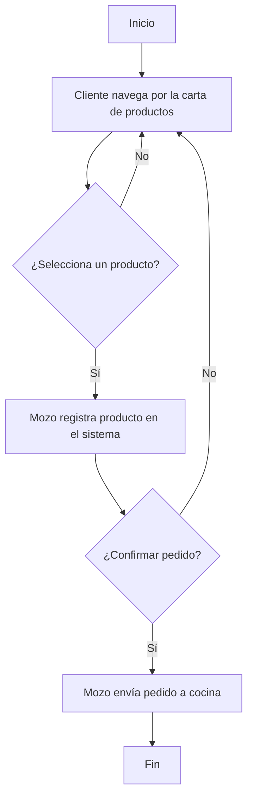
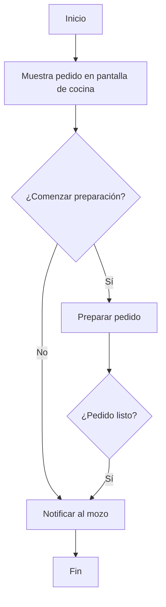
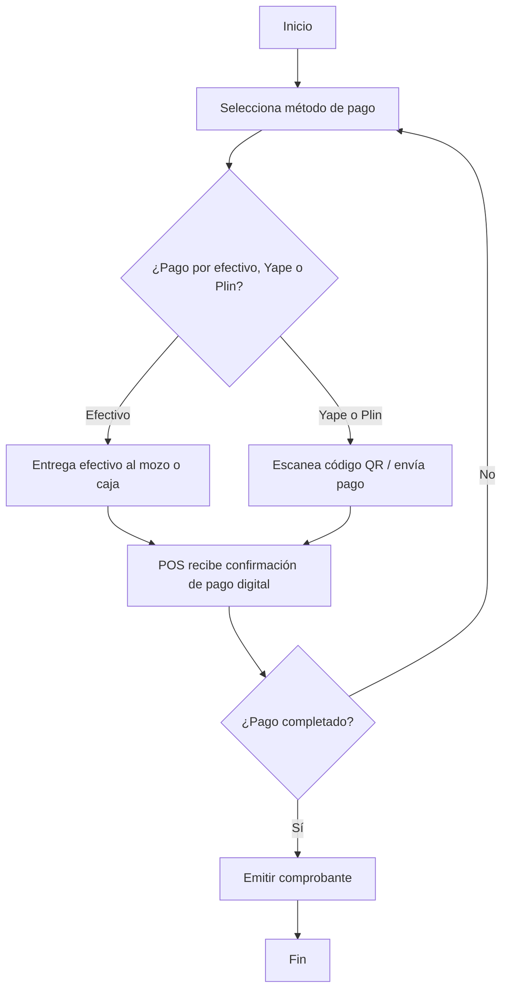

## Módulo 1: Pedido del Cliente

```mermaid
flowchart TD
    A[Inicio] --> B[Cliente navega por la carta de productos]
    B --> C{¿Selecciona un producto?}
    C -->|No| B
    C -->|Sí| D[Mozo registra producto en el sistema]
    D --> E{¿Confirmar pedido?}
    E -->|No| B
    E -->|Sí| F[Mozo envía pedido a cocina]
    F --> G[Fin]
```
## Módulo 2: Preparación en Cocina

```mermaid
flowchart TD
    A[Inicio] --> B[Muestra pedido en pantalla de cocina]
    B --> C{¿Comenzar preparación?}
    C -->|No| F[Notificar al mozo]
    C -->|Sí| D[Preparar pedido]
    D --> E{¿Pedido listo?}
    E -->|Sí| F[Notificar al mozo]
    F --> G[Fin]
```
## Modulo 3: Confirmación y Pago

```mermaid
flowchart TD
    A[Inicio] --> B[Selecciona método de pago]
    B --> C{¿Pago por efectivo, Yape o Plin?}
    C -->|Efectivo| D[Entrega efectivo al mozo o caja]
    C -->|Yape o Plin| E[Escanea código QR / envía pago]
    D --> F[POS registra pago recibido]
    E --> F[POS recibe confirmación de pago digital]
    F --> G{¿Pago completado?}
    G -->|Sí| H[Emitir comprobante]
    G -->|No| B
    H --> I[Fin]
```

