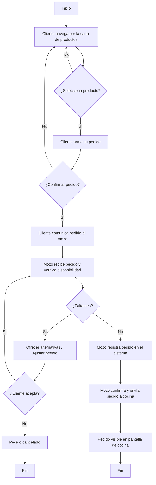
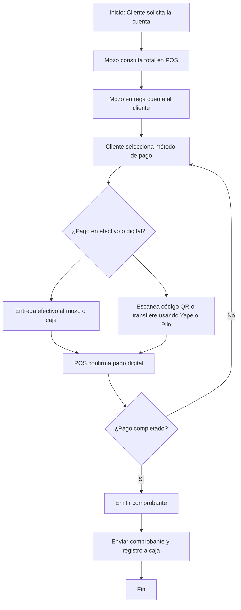

## Módulo 1: Pedido del Cliente y Registro y Envio a Cocina

```mermaid
flowchart TD
    A[Inicio] --> B[Cliente navega por la carta de productos]
    B --> C{¿Selecciona producto?}
    C -->|No| B
    C -->|Sí| D[Cliente arma su pedido]
    D --> E{¿Confirmar pedido?}
    E -->|No| B
    E -->|Sí| F[Cliente comunica pedido al mozo]
    F --> G[Mozo recibe pedido y verifica disponibilidad]
    G --> H{¿Faltantes?}
    H -->|Sí| I[Ofrecer alternativas / Ajustar pedido]
    I --> J{¿Cliente acepta?}
    J -->|No| K[Pedido cancelado] --> Z[Fin]
    J -->|Sí| G
    H -->|No| L[Mozo registra pedido en el sistema]
    L --> M[Mozo confirma y envía pedido a cocina]
    M --> N[Pedido visible en pantalla de cocina]
    N --> O[Fin]

```

## Modulo 4: Confirmación y Recepcion del Pago

```mermaid
flowchart TD
    A[Inicio: Cliente solicita la cuenta] --> B[Mozo consulta total en POS]
    B --> C[Mozo entrega cuenta al cliente]
    C --> D[Cliente selecciona método de pago]
    D --> E{¿Pago en efectivo o digital?}
    E --> F[Entrega efectivo al mozo o caja]
    E --> G[Escanea código QR o transfiere usando Yape o Plin]
    F --> H[POS registra pago en efectivo]
    G --> H[POS confirma pago digital]
    H --> I{¿Pago completado?}
    I -->|No| D
    I -->|Sí| J[Emitir comprobante]
    J --> K[Enviar comprobante y registro a caja]
    K --> L[Fin]
```

