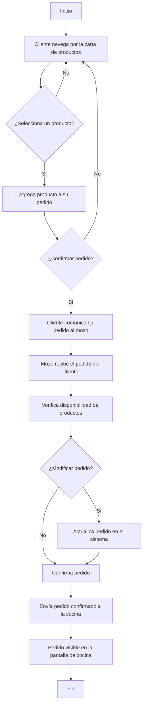
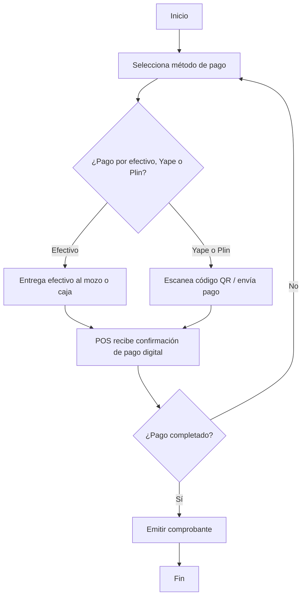

## Módulo 1: Pedido del Cliente y Registro y Envio a Cocina

```mermaid
flowchart TD
    A[Inicio] --> B[Cliente navega por la carta de productos]
    B --> C{¿Selecciona un producto?}
    C -->|No| B
    C -->|Sí| D[Agrega producto a su pedido]
    D --> E{¿Confirmar pedido?}
    E -->|No| B
    E -->|Sí| F[Cliente comunica su pedido al mozo]
    F --> G[Mozo recibe el pedido del cliente]
    G --> H[Verifica disponibilidad de productos]
    H --> I{¿Modificar pedido?}
    I -->|Sí| J[Actualiza pedido en el sistema]
    I -->|No| K[Confirma pedido]
    J --> K
    K --> L[Envía pedido confirmado a la cocina]
    L --> M[Pedido visible en la pantalla de cocina]
    M --> N[Fin]
```
## Modulo 3: Confirmación y Pago

```mermaid
flowchart TD
    A[Inicio] --> B[Selecciona método de pago]
    B --> C{¿Pago por efectivo, Yape o Plin?}
    C -->|Efectivo| D[Entrega efectivo al mozo o caja]
    C -->|Yape o Plin| E[Escanea código QR / envía pago]
    D --> F[POS registra pago recibido]
    E --> F[POS recibe confirmación de pago digital]
    F --> G{¿Pago completado?}
    G -->|Sí| H[Emitir comprobante]
    G -->|No| B
    H --> I[Fin]
```

