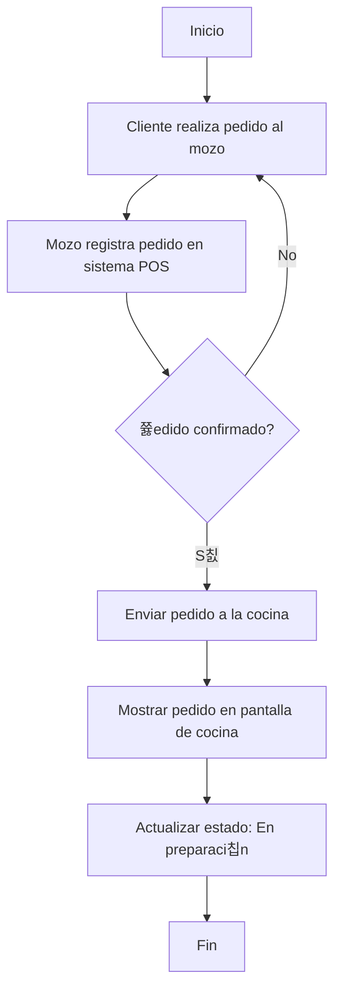
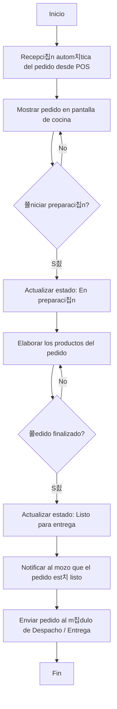
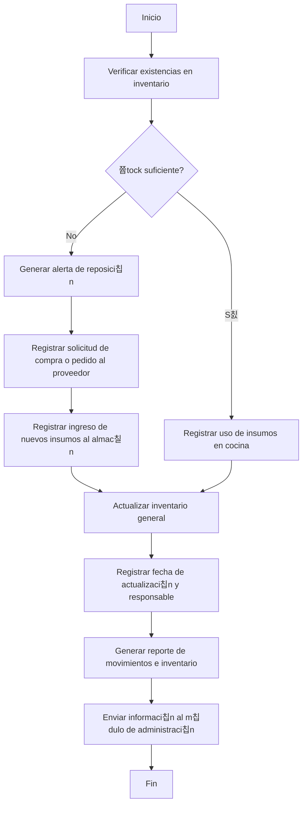
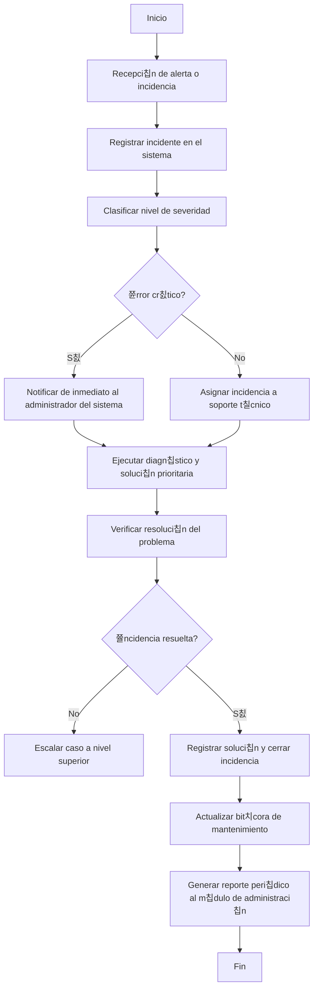

# Diagramas de Flujo del Sistema Cafecito

Este documento contiene los diagramas de flujo que describen el funcionamiento completo del sistema de gestión de pedidos **Cafecito**, desde la toma del pedido hasta la administración y resolución de incidencias.

---

##  Diagrama 1: Modulo de toma y registro de pedidos 

---

##  Diagrama 2: Modulo de produccion

---

##  Diagrama 3: Modulo de despacho y entrega

---

##  Diagrama 4: Modulo de facturacion y pagos

---

##  Diagrama 5: Modulo de administracion y reportes

---

##  Diagrama 6: Modulo de abastecimiento e inventario

---

##  Diagrama 7: Modulo de soporte y mantenimiento del sistema 

---

## 📘 Descripción General

Estos diagramas representan el flujo lógico y funcional de los principales módulos del sistema:

- **Diagrama 1**: Modulo de toma y registro de pedidos 
- **Diagrama 2**: Modulo de produccion 
- **Diagrama 3**: Modulo de despacho y entrega 
- **Diagrama 4**: Modulo de facturacion y pagos  
- **Diagrama 5**: Modulo de administracion y reportes
- **Diagrama 6**: Modulo de abastecimiento e inventario
- **Diagrama 7**: Modulo de soporte y mantenimiento del sistema  

Proyecto Universitario de Gestión Cafecito

